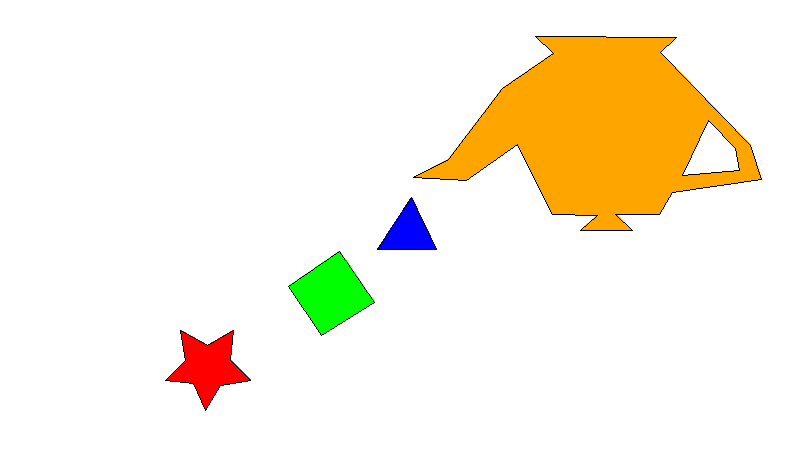

# Laboratorio 1 - Relleno de Polígonos

Programa en Rust que dibuja y rellena polígonos de más de 4 lados usando el
algoritmo de Scanline (línea de barrido) con regla par-impar, incluyendo
soporte para agujeros dentro de un polígono.

## Requisitos

- Rust y Cargo instalados ([rustup.rs](https://rustup.rs))

## Cómo correrlo

```bash
cargo run
```

Esto genera el archivo out.png en la raíz del proyecto con los 5 polígonos
rellenos de sus colores correspondientes.

## Estructura del proyecto

```
src/
├── main.rs     # Define los polígonos y arma la escena
├── point.rs    # Struct Point (x, y)
├── line.rs     # Dibujo de líneas con el algoritmo de Bresenham
└── polygon.rs  # Struct Polygon y algoritmo de relleno scanline
```

## Algoritmo de relleno

Para cada fila (`y`) del área del polígono, se calculan las intersecciones
de la línea de barrido con todas las aristas de la figura. Se ordenan de
izquierda a derecha y se pintan los píxeles entre cada par de intersecciones
(regla par-impar).

El polígono 5 es un agujero dentro del polígono 4: al combinar las aristas
de ambos en una sola llamada de relleno, el agujero queda automáticamente
sin pintar gracias a la regla par-impar.

## Resultado


